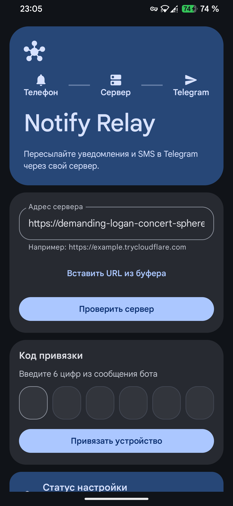
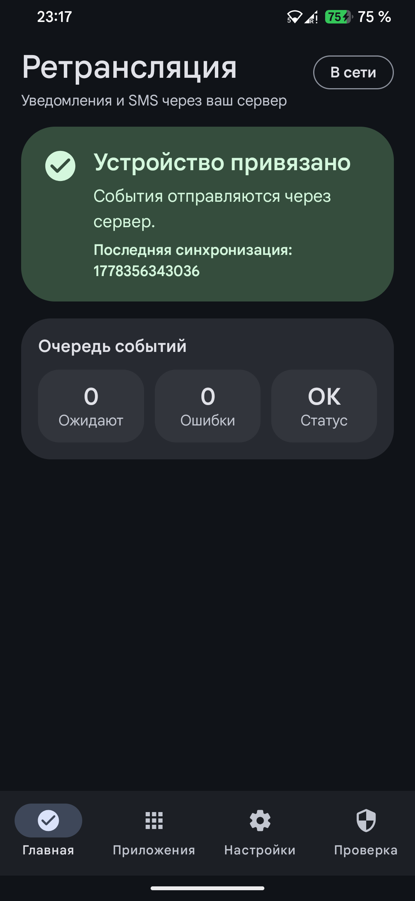
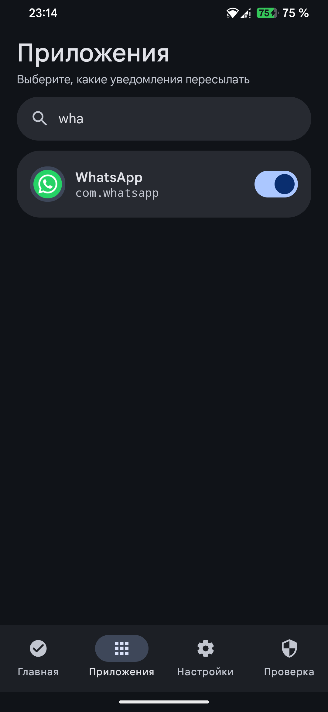
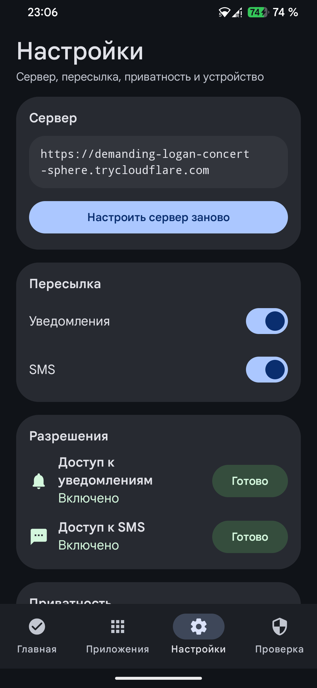
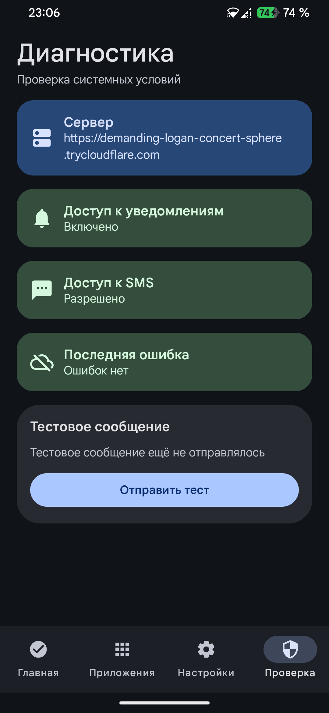

<p align="center">
  
</p>

<h1 align="center">Notify Relay</h1>

<p align="center">
  A private Android notification and SMS relay to Telegram through your own server.
</p>

<p align="center">
  <a href="README.ru.md">Русская версия</a>
</p>

<table align="center">
  <tr>
    <td align="center" width="760">
      <h3>Keep Notify Relay independent</h3>
      <p>If this project helps you, support further development, testing, and server tooling.</p>
      <a href="https://nowpayments.io/donation/svllvsx">
        
      </a>
    </td>
  </tr>
</table>

<p align="center">
  
  
  
  
  
</p>

<p align="center">
  <a href="#screenshots">Screenshots</a> ·
  <a href="#what-it-does">What It Does</a> ·
  <a href="#install-the-server">Install Server</a> ·
  <a href="#install-the-android-app">Install Android</a> ·
  <a href="#security-model">Security</a>
</p>

## Screenshots

<p align="center">
  
  
  
  
  
</p>

## What It Does

Notify Relay lets you forward selected Android notifications and SMS messages to Telegram without giving the Android app your Telegram bot token.

The Android app sends events only to your server. The server owns the Telegram bot token, links your device to a Telegram chat through a short pairing code, and delivers events to the linked chat.

## Features

- Notification forwarding from selected apps.
- SMS forwarding when Android SMS permission is granted.
- Telegram pairing through `/start` and a short 6-digit code.
- Private bot mode with `ALLOWED_TELEGRAM_CHAT_IDS` allowlist.
- App picker with search and a toggle for system apps.
- Privacy modes: full text, masked sensitive values, or event-only.
- RU/EN Android UI with system-language default.
- Server storage in PostgreSQL when deployed with Docker.
- Local JSON fallback for development without PostgreSQL.
- One-command server installer with Docker, Postgres, Caddy, and Cloudflare quick tunnel support.

## Architecture

```text
Android phone
  -> Notify Relay Android app
  -> Your Notify Relay server
  -> Telegram Bot API
  -> Your Telegram chat
```

The Telegram bot token never goes into the Android app.

## Requirements

For Android:

- Android 8.0+.
- Notification access permission for notification forwarding.
- SMS permission only if you want SMS forwarding.

For the server:

- A Linux VPS/server is recommended.
- `curl` and `tar` for the standalone installer.
- Docker is installed automatically if missing.
- Caddy is installed automatically on apt-based systems only when you choose own-domain mode.

## Create a Telegram Bot

1. Open Telegram and message `@BotFather`.
2. Run `/newbot`.
3. Choose a bot name and username.
4. Copy the bot token. It looks like `<number>:<secret>`.
5. Keep the token private. You will paste it only into the server installer.

## Get Your Telegram Chat ID

If you want private bot mode, you need your numeric Telegram chat id.

One simple way:

1. Temporarily run the server without `ALLOWED_TELEGRAM_CHAT_IDS`.
2. Send `/start` to your bot.
3. Check server logs or Telegram bot updates to identify your chat id.
4. Re-run the installer with `--reconfigure` and set `ALLOWED_TELEGRAM_CHAT_IDS`.

If you already know your chat id, enter it during installation. Multiple ids are comma-separated.

## Install The Server

Run this on your Linux server:

```bash
curl -fsSL https://raw.githubusercontent.com/svllvsxprod/Notify_Relay/main/server/install.sh | bash
```

The script will ask for:

- Language: Russian or English.
- `TELEGRAM_BOT_TOKEN` from BotFather.
- Allowed Telegram chat ids. Empty means any user who sends `/start` can pair.
- Access mode: own domain with Caddy or Cloudflare quick tunnel.

The installer downloads the server files from GitHub into:

```text
/opt/notify-relay-server
```

You can override it:

```bash
NOTIFY_RELAY_DIR=$HOME/notify-relay-server curl -fsSL https://raw.githubusercontent.com/svllvsxprod/Notify_Relay/main/server/install.sh | bash
```

### Own Domain Mode

Choose this when you have a domain pointed to your server.

What the installer does:

- Runs Node.js app and PostgreSQL in Docker.
- Finds a free local port in `18000..18999`.
- Publishes the app only on `127.0.0.1:<free_port>`.
- Installs Caddy on the host if missing and apt is available.
- Appends a Caddy block instead of overwriting `/etc/caddy/Caddyfile`.
- Reloads Caddy.

The backend URL will be:

```text
https://your-domain.example
```

### Cloudflare Quick Tunnel Mode

Choose this if you do not have a domain.

What the installer does:

- Runs Node.js app and PostgreSQL in Docker.
- Runs `cloudflared` in Docker.
- Does not publish any external port.
- Prints how to view the generated tunnel URL.

Get the URL:

```bash
cd /opt/notify-relay-server
docker compose logs -f tunnel
```

Important: Cloudflare quick tunnel URLs may change after restarting the tunnel, container, or server. Save the current URL into the Android app, and check it again if the app stops reaching the server.

## Server Status And Reconfiguration

Run the installer again to show status and the current URL:

```bash
curl -fsSL https://raw.githubusercontent.com/svllvsxprod/Notify_Relay/main/server/install.sh | bash
```

Reconfigure from scratch:

```bash
curl -fsSL https://raw.githubusercontent.com/svllvsxprod/Notify_Relay/main/server/install.sh | bash -s -- --reconfigure
```

Useful commands after install:

```bash
cd /opt/notify-relay-server
docker compose ps
docker compose logs -f app
docker compose logs -f tunnel
docker compose pull
docker compose up -d --build
```

## Install The Android App

1. Open the latest GitHub Release.
2. Download the APK asset named like `Notify-Relay-v1.5.3-release.apk`.
3. Install it on your Android device.
4. Open the app.
5. Enter your server URL.
6. Tap the server check button.
7. Open your Telegram bot and send `/start`.
8. Enter the 6 digits from the bot message into the app.
9. Grant notification access.
10. Select apps whose notifications should be forwarded.
11. Optional: enable SMS forwarding and grant SMS permission.

## Android Settings Explained

- Notifications: enables or disables notification forwarding globally.
- SMS: enables or disables SMS forwarding globally.
- Privacy: controls how much text is sent to Telegram.
- Language: system default, Russian, or English.
- Show system apps: controls whether system apps appear in the app picker.

## Privacy Modes

- Full text: sends notification and SMS content as-is.
- Masked: keeps useful context but masks codes, phone numbers, cards, and email-like values.
- Event only: sends only the fact that an event happened.

## Security Model

- Telegram bot token is stored only on your server.
- Android stores only its device id and device token.
- Server supports private bot mode with `ALLOWED_TELEGRAM_CHAT_IDS`.
- `.env`, runtime database files, local Android SDK paths, and build outputs are ignored by git.
- The public repository contains placeholders only.

## Project Layout

```text
android-app/  Android app built with Kotlin and Jetpack Compose
server/       Node.js backend, Docker deployment, PostgreSQL storage
screens/      Public screenshots and logo used by documentation
```

## Development

Build Android debug APK locally:

```bash
cd android-app
./gradlew :app:assembleDebug
```

Run server locally without Postgres:

```bash
cd server
npm install
npm run dev
```

For Android emulator, use:

```text
http://10.0.2.2:8000
```
